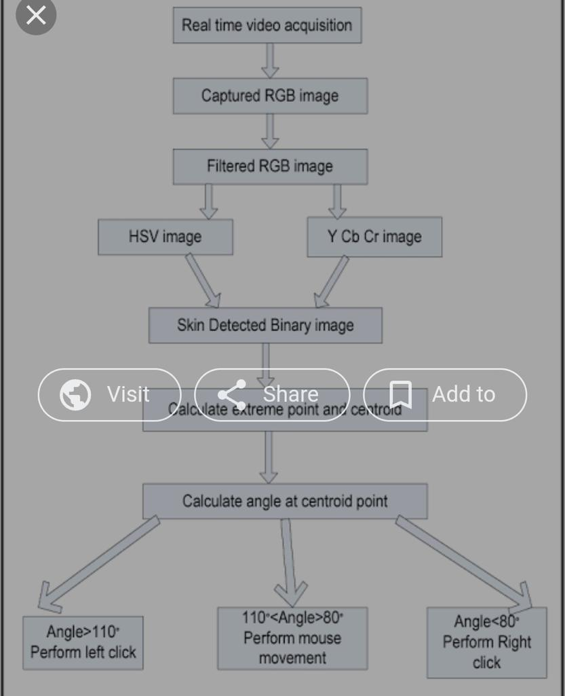

<!DOCTYPE html>
<html lang="en">
<head>
    <meta charset="UTF-8">
    <meta http-equiv="X-UA-Compatible" content="IE=edge">
    <meta name="viewport" content="width=device-width, initial-scale=1.0">
    <title>Document</title>
</head>

<body>
    

 
          <a href="SEPM grp project complete.pdf" target="_blank">
            <button class="btn"> Download </button></a>
            

    

    

       
    business case:

Problem Statement: 

Scope of the Project: 
• Advancement in virtual mouse with help of AI. 
• Make Extension compatible with different website format. 

The AI virtual mouse system is useful for many applications; it can be used to reduce the space for using the physical mouse, and it can be used in situations where we cannot use the physical mouse. The system eliminates the usage of devices, and it improves the human-computer interaction 

<b>benifits </b>

The AI virtual mouse system is useful for many applications; it can be used to reduce the space for using the physical mouse, and it can be used in situations where we cannot use the physical mouse. The system eliminates the usage of devices, and it improves the human-computer interaction. 

limitation  

Without the help of automation day to day work is becoming highly straining. A user needs to operate a mouse with his/her hand. Continuous clicking on mouse can strain fingers which can result in health problems. 

Approach: 
For Making Web Vision, we’ll use the following python libraries: 


    

</body>
</html>
